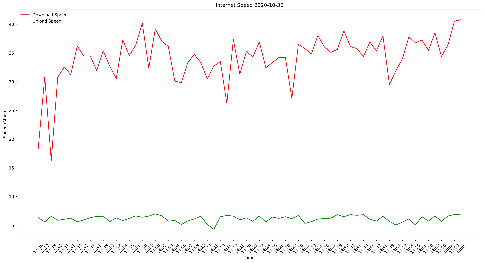

# Monitor Internet Speeds With Python

- _version: 0.0.2_

Use Python and the speedtest-cli to monitor upload and download speeds over a specified period of time & produce a visualization using matplotlib.

## How to Use

1. Open your favorite terminal and run `python monitor.py`.
   You will be asked to enter time delay interval in minutes.
2. You will then be asked how long you wish to run the test for. (Again, in minutes).
3. A graphical representation of your internet performance will be produced and stored in `Output`.

## Dependancies

- matplotlib
- speedtest-cli
- requests
